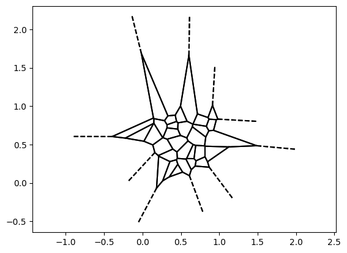

Power diagram
=============

Power diagram (or Laguerre diagram) can be considerer as a generalization of Voronoi diagrams where each seeds has weights, allowing notably displacement of the cells.

In python the wrapper class is named `PowerDiagram`. It handles 
* virtual seeds, for periodicity handling,
* any number of dimension (>= 1),
* large vectors (notably for out-of-core or MPI computations).

It is optionaly equiped with an underlying measure (Lebesgue bye default), for methods like `cell_integrals`.

Construction and visualization
==============================

```python
from sdot import PowerDiagram

# we add some 2D seeds. By default, weights are equal to 1, leading to a voronoi diagram
pd = PowerDiagram( positions = np.random.random( [ 40, 2 ] ) )

# plot_in_pyplot takes pyplot figure as input 
pd.plot_in_pyplot( plt )
plt.show()
```

gives something like:



By default, power diagrams are unbounded. It is possible to add bounds using affine functions as illustrated here:

```python
from sdot import PowerDiagram
import numpy as np

# we center the points around 0 for this example
pd = PowerDiagram( np.random.random( [ 40, 2 ] ) - 0.5 )

# Here we use a setter to set a value after the call of the constructor (we can do the same thing for positions, weights, ...)
# In this example we add 5 affine functions defined by the directions [ np.cos( a ), np.sin( a ) ] and offsets equal to 1
# A point x is exterior when `dot( direction, x ) - offset > 0` 
pd.boundaries = [ [ np.cos( a ), np.sin( a ), 1 ] for a in np.linspace( 0, 2 * np.pi, 5, endpoint=False ) ]

pd.plot_in_pyplot( plt )
plt.show()
```

It gives something like:


